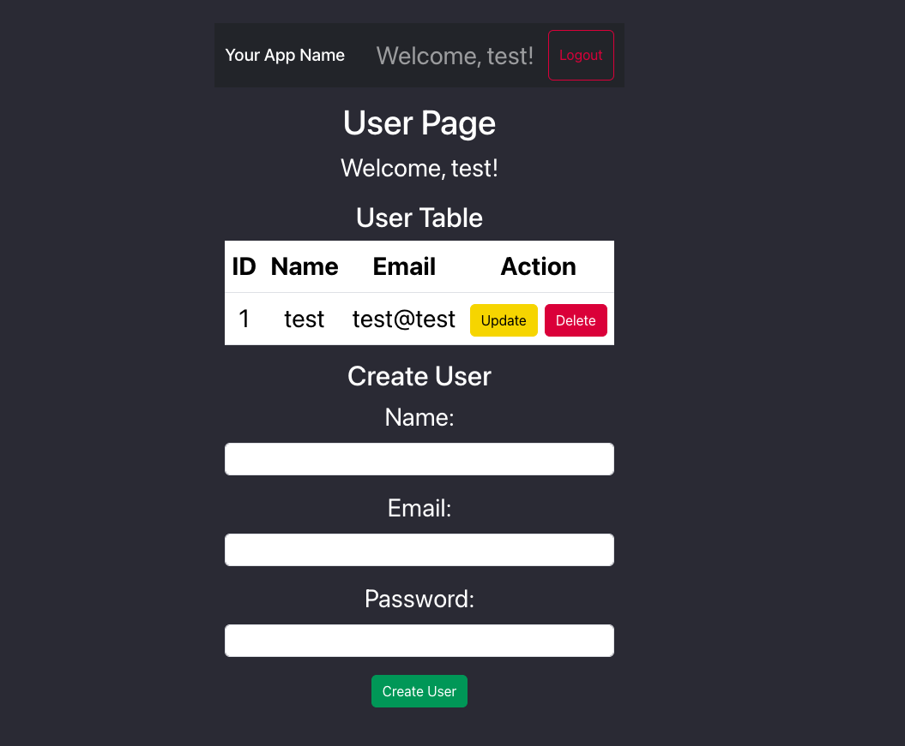
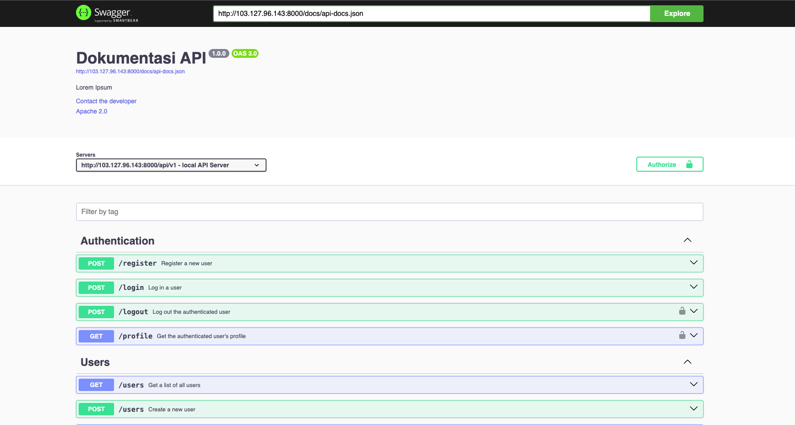

# Laravel 9.0 (PHP), Reactjs (Typescript) 18.2 & MySQL With Docker Compose

The following are separate packages between Laravel and ReactJS that run in each env
Laravel can be used only as a backend-api and for ReactJS it can be used as a frontend, using MySQL as the data base.

Reactjs Port 3000

Laravel Port 8000

## Sample Run

1. frontend [link](http://103.127.96.143:3000/)

1. backend swagger api doc [link](http://103.127.96.143:8000/api/documentation)

## dependencies

1. Laravel (PHP)

    - laravel

    - laravel/sanctum `token auth`

    - darkaonline/l5-swagger `backend api doc`

1. Reactjs (Typescript)

    - react

    - react-dom `dom js`

    - react-router-dom `routers`

    - bootstrap `template style`

    - axios `fetch api`

    - fortawesome `free icon`

# Installation

1.  install [docker](https://docs.docker.com/engine/) & [docker-compose v3](https://docs.docker.com/compose/compose-file/compose-file-v3/) or [docker desktop](https://www.docker.com/get-started/)
1. `docker-compose up -d` or [VSCode Extension](https://github.com/microsoft/vscode-docker) or [jetBean Plugin](https://plugins.jetbrains.com/plugin/7724-docker)

just run and ez too use

## Using For Develop Mode

run docker compose
`docker compose start laravel-reactjs` or run from docker desktop or docker vscode/jetbean

1. Laravel

    - go to terminal docker laravel `docker exec -it laravel-app /bin/bash`

    - run key artisan `composer install`

    - run key artisan `cp .env.example .env`

    - run key artisan `php artisan key:generate`

    - run migrate artisan `php artisan migrate`

    - run serve artisan `php artisan serve`

1. Reactjs

    - already run serve

    - open browser `localhost:3000`

## Backend Test (Swagger Documentation)

list documentation api `http://localhost:8000/api/documentation`

this swagger using [L5-Swagger](https://github.com/DarkaOnLine/L5-Swagger)

read example api for detail [here](https://github.com/zircote/swagger-php/tree/master/Examples/petstore-3.0)

## Build

you need connect ur vps or server to docker repo and run it

1. Reactjs

    - change dockerfile at root project with at `/production` folder

1. push to ur server

1. run docker compose

    `docker compose -f "docker-compose.yml" up -d --build `

1. now u can use port forwarding or nginx-proxy-manager to config ur port backend and frontend

[read this for setup to server](https://github.com/NginxProxyManager/nginx-proxy-manager)

Support Me For Coffe [sociabuzz](https://sociabuzz.com/hadit120/tribe) or [buymeacoffee](https://www.buymeacoffee.com/had12)